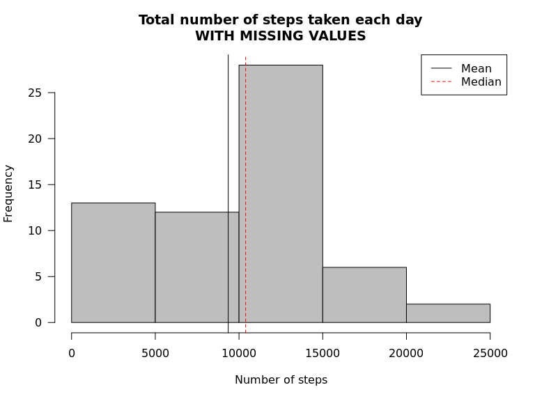
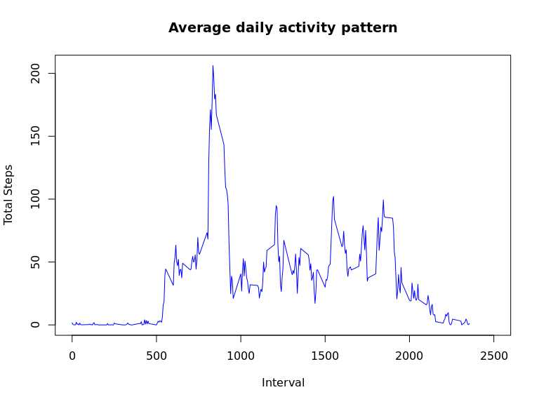
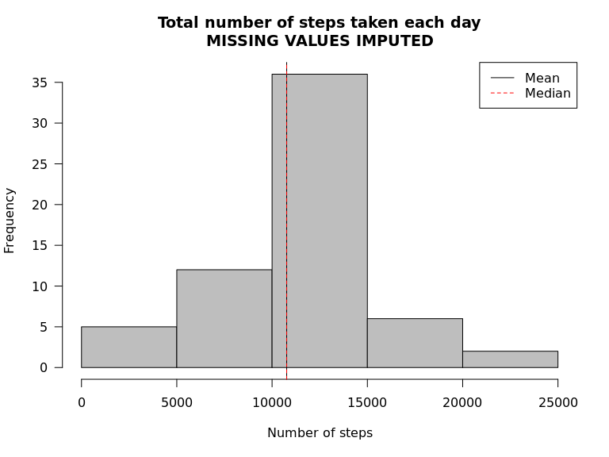
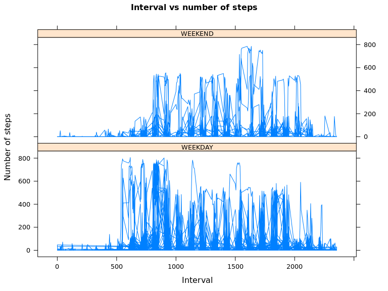

# Reproducible Research: Peer Assessment 1
Remco Keijser - JAN-2016  


## Loading and preprocessing the data

```r
import.data <- read.csv(file="activity.csv", header=TRUE)
import.data$date <- as.Date(as.character(import.data$date, format = "%Y/%m/%d"))
```


```r
# INSTALL PACKAGES
# install.packages("dplyr")             # Install dplyr package
# install.packages("timeDate")          # Install timeDate package
# install.packages("lattice")           # Install lattice package
```

## What is mean total number of steps taken per day?

```r
library("dplyr")
STATS <- summarise(group_by(import.data, date),
                   sum_NA = sum(is.na(steps)),
                   sum_steps = sum(steps, na.rm=TRUE),
                   mean_steps = mean(steps, na.rm=TRUE),
                   median_steps = median(steps, na.rm = TRUE)
)
```


```r
hist(STATS$sum_steps,
     main="Total number of steps taken each day\nWITH MISSING VALUES",
     xlab="Number of steps",
     border="black",
     col="grey",
     xlim=c(0,25000),
     las=1,
     breaks=5)
abline( v = mean(STATS$sum_steps), col=1, lty = 1)
abline( v = median(STATS$sum_steps), col=2, lty = 2)
legend("topright", legend = c("Mean", "Median"), col=c(1,2), lty=c(1,2))
```

\


```r
library(knitr)
#kable(STATS, digits=2)
STATS
```

```
## Source: local data frame [61 x 5]
## 
##          date sum_NA sum_steps mean_steps median_steps
##        (date)  (int)     (int)      (dbl)        (dbl)
## 1  2012-10-01    288         0        NaN           NA
## 2  2012-10-02      0       126    0.43750            0
## 3  2012-10-03      0     11352   39.41667            0
## 4  2012-10-04      0     12116   42.06944            0
## 5  2012-10-05      0     13294   46.15972            0
## 6  2012-10-06      0     15420   53.54167            0
## 7  2012-10-07      0     11015   38.24653            0
## 8  2012-10-08    288         0        NaN           NA
## 9  2012-10-09      0     12811   44.48264            0
## 10 2012-10-10      0      9900   34.37500            0
## ..        ...    ...       ...        ...          ...
```

## What is the average daily activity pattern?


```r
STATS2 <- summarise(group_by(import.data, interval),
                    average_steps = mean(steps, na.rm=TRUE))
```


```r
plot(STATS2$interval, STATS2$average_steps, type='l',
     main="Average daily activity pattern",
     xlab="Interval",
     ylab="Total Steps",
     col="blue",
     xlim=c(0,2500))
```

\


```r
max_steps <- max(STATS2$average_steps)
max_interval <- STATS2[STATS2$average_steps==max_steps,]
max_interval
```

```
## Source: local data frame [1 x 2]
## 
##   interval average_steps
##      (int)         (dbl)
## 1      835      206.1698
```
#### **Interval 835 contains the maximum number of steps.**

## Imputing missing values


```r
library(knitr)
kable(summary(import.data))
```

         steps             date               interval    
---  ---------------  -------------------  ---------------
     Min.   :  0.00   Min.   :2012-10-01   Min.   :   0.0 
     1st Qu.:  0.00   1st Qu.:2012-10-16   1st Qu.: 588.8 
     Median :  0.00   Median :2012-10-31   Median :1177.5 
     Mean   : 37.38   Mean   :2012-10-31   Mean   :1177.5 
     3rd Qu.: 12.00   3rd Qu.:2012-11-15   3rd Qu.:1766.2 
     Max.   :806.00   Max.   :2012-11-30   Max.   :2355.0 
     NA's   :2304     NA                   NA             

#### **In total 2304 missing values in variable steps. 8 days are missing step values**


```r
#kable(STATS[c(1,8,32,35,40,41,45,61),c(1,2)])
STATS[c(1,8,32,35,40,41,45,61),c(1,2)]
```

```
## Source: local data frame [8 x 2]
## 
##         date sum_NA
##       (date)  (int)
## 1 2012-10-01    288
## 2 2012-10-08    288
## 3 2012-11-01    288
## 4 2012-11-04    288
## 5 2012-11-09    288
## 6 2012-11-10    288
## 7 2012-11-14    288
## 8 2012-11-30    288
```

#### **Stratergy chosen to impute missing values: use the mean for that 5-minute interval.**


```r
import.data.imputed <- merge(import.data, STATS2, by.x = "interval", by.y = "interval")
import.data.imputed <- import.data.imputed[order(as.Date(import.data.imputed$date, format="%d/%m/%Y")),]
import.data.imputed$steps.imputed <- NA

for(i in 1:length(import.data.imputed$steps)){
        
        if(is.na(import.data.imputed[i,2])) {
                
                import.data.imputed[i,5] <- import.data.imputed[i,4]
        }
        
        if(!is.na(import.data.imputed[i,2])) {
                
                import.data.imputed[i,5] <- import.data.imputed[i,2]
        }
}

import.data.imputed <- import.data.imputed[,c(2,5,3,1)]
```


```r
library(knitr)
#kable(head(import.data.imputed, n=50))
head(import.data.imputed, n=50)
```

```
##      steps steps.imputed       date interval
## 1       NA     1.7169811 2012-10-01        0
## 63      NA     0.3396226 2012-10-01        5
## 128     NA     0.1320755 2012-10-01       10
## 205     NA     0.1509434 2012-10-01       15
## 264     NA     0.0754717 2012-10-01       20
## 327     NA     2.0943396 2012-10-01       25
## 376     NA     0.5283019 2012-10-01       30
## 481     NA     0.8679245 2012-10-01       35
## 495     NA     0.0000000 2012-10-01       40
## 552     NA     1.4716981 2012-10-01       45
## 620     NA     0.3018868 2012-10-01       50
## 716     NA     0.1320755 2012-10-01       55
## 770     NA     0.3207547 2012-10-01      100
## 840     NA     0.6792453 2012-10-01      105
## 880     NA     0.1509434 2012-10-01      110
## 924     NA     0.3396226 2012-10-01      115
## 1018    NA     0.0000000 2012-10-01      120
## 1097    NA     1.1132075 2012-10-01      125
## 1141    NA     1.8301887 2012-10-01      130
## 1183    NA     0.1698113 2012-10-01      135
## 1230    NA     0.1698113 2012-10-01      140
## 1320    NA     0.3773585 2012-10-01      145
## 1388    NA     0.2641509 2012-10-01      150
## 1443    NA     0.0000000 2012-10-01      155
## 1507    NA     0.0000000 2012-10-01      200
## 1547    NA     0.0000000 2012-10-01      205
## 1630    NA     1.1320755 2012-10-01      210
## 1690    NA     0.0000000 2012-10-01      215
## 1731    NA     0.0000000 2012-10-01      220
## 1774    NA     0.1320755 2012-10-01      225
## 1882    NA     0.0000000 2012-10-01      230
## 1946    NA     0.2264151 2012-10-01      235
## 2000    NA     0.0000000 2012-10-01      240
## 2048    NA     0.0000000 2012-10-01      245
## 2130    NA     1.5471698 2012-10-01      250
## 2179    NA     0.9433962 2012-10-01      255
## 2224    NA     0.0000000 2012-10-01      300
## 2280    NA     0.0000000 2012-10-01      305
## 2349    NA     0.0000000 2012-10-01      310
## 2405    NA     0.0000000 2012-10-01      315
## 2444    NA     0.2075472 2012-10-01      320
## 2550    NA     0.6226415 2012-10-01      325
## 2581    NA     1.6226415 2012-10-01      330
## 2675    NA     0.5849057 2012-10-01      335
## 2720    NA     0.4905660 2012-10-01      340
## 2788    NA     0.0754717 2012-10-01      345
## 2856    NA     0.0000000 2012-10-01      350
## 2898    NA     0.0000000 2012-10-01      355
## 2942    NA     1.1886792 2012-10-01      400
## 3018    NA     0.9433962 2012-10-01      405
```


```r
STATS3 <- summarise(group_by(import.data.imputed, date),
                    sum_NA = sum(is.na(steps)),
                    sum_NA.imputed = sum(is.na(steps.imputed)),
                    sum_steps = sum(steps, na.rm=TRUE),
                    mean_steps = mean(steps, na.rm=TRUE),
                    median_steps = median(steps, na.rm = TRUE),
                    
                    sum_steps.imputed = sum(steps.imputed, na.rm=TRUE),
                    mean_steps.imputed = mean(steps.imputed, na.rm=TRUE),
                    median_steps.imputed = median(steps.imputed, na.rm = TRUE))
```


```r
hist(STATS3$sum_steps.imputed,
     main="Total number of steps taken each day\nMISSING VALUES IMPUTED",
     xlab="Number of steps",
     border="black",
     col="grey",
     xlim=c(0,25000),
     las=1,
     breaks=5)
abline( v = mean(STATS3$sum_steps.imputed), col=1, lty = 1)
abline( v = median(STATS3$sum_steps.imputed), col=2, lty = 2)
legend("topright", legend = c("Mean", "Median"), col=c(1,2), lty=c(1,2))
```

\


```r
#kable(STATS3)
STATS3
```

```
## Source: local data frame [61 x 9]
## 
##          date sum_NA sum_NA.imputed sum_steps mean_steps median_steps
##        (date)  (int)          (int)     (int)      (dbl)        (dbl)
## 1  2012-10-01    288              0         0        NaN           NA
## 2  2012-10-02      0              0       126    0.43750            0
## 3  2012-10-03      0              0     11352   39.41667            0
## 4  2012-10-04      0              0     12116   42.06944            0
## 5  2012-10-05      0              0     13294   46.15972            0
## 6  2012-10-06      0              0     15420   53.54167            0
## 7  2012-10-07      0              0     11015   38.24653            0
## 8  2012-10-08    288              0         0        NaN           NA
## 9  2012-10-09      0              0     12811   44.48264            0
## 10 2012-10-10      0              0      9900   34.37500            0
## ..        ...    ...            ...       ...        ...          ...
## Variables not shown: sum_steps.imputed (dbl), mean_steps.imputed (dbl),
##   median_steps.imputed (dbl)
```

#### **The mean and median differ of the imputed day.**
#### **As shown in the two histograms the mean and the median also changes slighly of the sum of the steps across al days**

## Are there differences in activity patterns between weekdays and weekends?


```r
library("timeDate")
import.data.imputed$weekday <- isWeekday(import.data.imputed$date, wday = 1:5)
import.data.imputed$weekend <- isWeekend(import.data.imputed$date, wday = 1:5)
import.data.imputed$day <- import.data.imputed$weekday
import.data.imputed$day[import.data.imputed$day == TRUE] <- "WEEKDAY"
import.data.imputed$day[import.data.imputed$day == FALSE] <- "WEEKEND"
kable(head(import.data.imputed, n=10))
```

       steps   steps.imputed  date          interval  weekday   weekend   day     
----  ------  --------------  -----------  ---------  --------  --------  --------
1         NA       1.7169811  2012-10-01           0  TRUE      FALSE     WEEKDAY 
63        NA       0.3396226  2012-10-01           5  TRUE      FALSE     WEEKDAY 
128       NA       0.1320755  2012-10-01          10  TRUE      FALSE     WEEKDAY 
205       NA       0.1509434  2012-10-01          15  TRUE      FALSE     WEEKDAY 
264       NA       0.0754717  2012-10-01          20  TRUE      FALSE     WEEKDAY 
327       NA       2.0943396  2012-10-01          25  TRUE      FALSE     WEEKDAY 
376       NA       0.5283019  2012-10-01          30  TRUE      FALSE     WEEKDAY 
481       NA       0.8679245  2012-10-01          35  TRUE      FALSE     WEEKDAY 
495       NA       0.0000000  2012-10-01          40  TRUE      FALSE     WEEKDAY 
552       NA       1.4716981  2012-10-01          45  TRUE      FALSE     WEEKDAY 


```r
library("lattice")
xyplot(steps.imputed  ~ interval| day, data=import.data.imputed,
       type = "l",
       layout = c(1, 2),
       par.strip.text=list(cex=0.8),
       xlab = "Interval",
       ylab=list(
               label="Number of steps",
               cex=1),
       main=list(
               label="Interval vs number of steps",
               cex=1),
       scales=list(cex=0.8)
)
```

\
